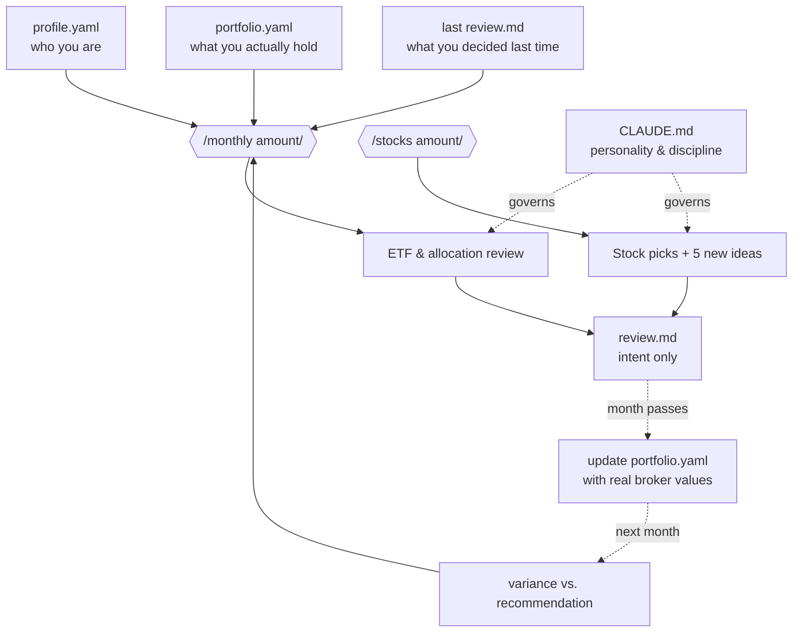

# finance-ai

A private finance agent. One prompt a month, and it tells you where to put the money.

It reads your profile, your holdings, your last decisions — and the market — and answers two questions:

1. How should this month's contribution split across assets?
2. Which stocks deserve the marginal dollar?

Plus a quiet third one: *what should you be watching that you're not?*

## The flow



## How to run

```
/monthly <amount>     # ETF + allocation layer
/stocks  <amount>     # individual stock layer
```

Each one returns a single dense table. No paragraphs, no filler.

## What makes it different

- **Source of truth is your portfolio, not the agent's memory.** Recommendations are intent. The variance between consecutive `portfolio.yaml` files is what really happened.
- **Consistency over agreement.** It won't flip a call without citing new data. It won't fold to pushback.
- **Discovery every cycle.** Five new candidates surface every month — not as buys, as a watchlist.
- **One file governs it all.** `CLAUDE.md` defines the personality. Change one file, every future review inherits it.

That's the whole system.
